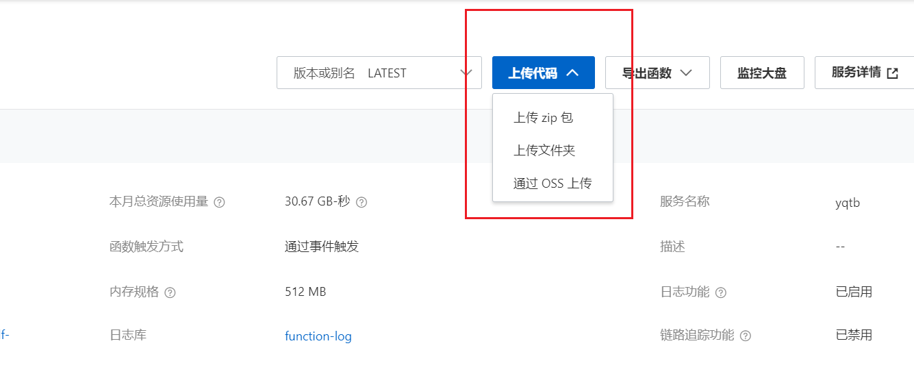
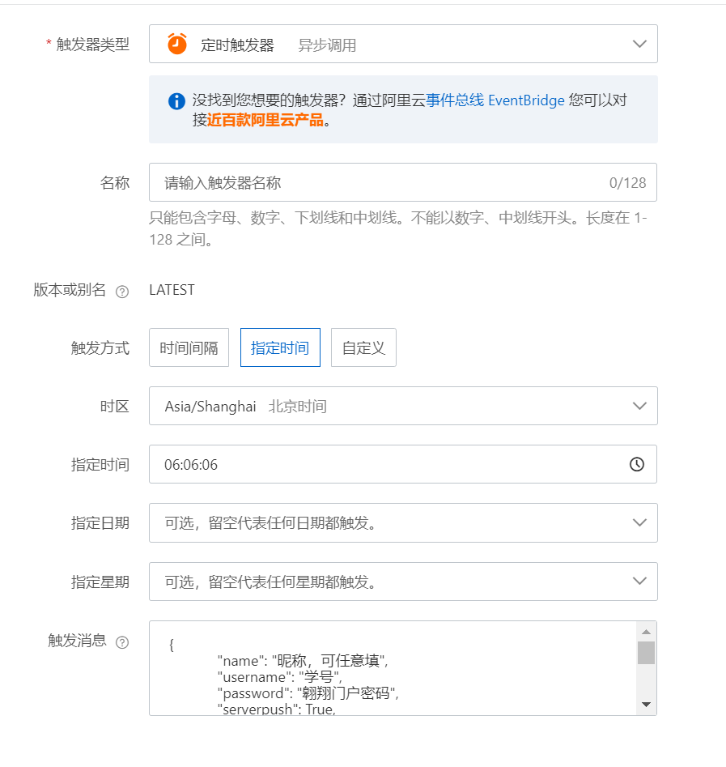

# NWPU_COVID19_AutoReport_By_AliyunFC

本程序魔改自 https://github.com/Pinming/NWPU_COVID19_AutoReport ，用于完成西工大每日健康的自动化申报。

通过阿里云函数进行部署，每日在进行自动填报后可选择通过微信推送或 Email 提醒填报结果。

## ⚠️ 使用前请注意！

-   本软件设计之本意为技术学习，请在**遵循法律及学校各项规定**的前提下使用本软件。
-   如您需要使用该软件，请**确保您的身体状况良好**，**如实申报**自身身体状况。
-   若您的身体状况出现异常，应**立即停止**使用本软件、**关闭**云函数自动触发功能，并及时于学校系统更改每日申报情况。
-   因使用该软件误报身体状况而引发的不良后果**应由您自行承担**。
-   本软件原理是提取上一次的填报结果来提交，如果您的所在地发生改变，请**自行手动填报一次**，理论上程序会自动跟进后续的填报并与之同步。
-   该软件并非万能，请勿依赖该软件，请**时常检查填报结果**。

## 基本配置方法

-   适用环境：Python 3.6 及以上版本。
-   对于阿里云函数，其程序入口为 `index.handler`。
-   对于本地运行环境，程序入口为 `report.main`。
-   关于 ServerChan 微信推送的配置，请参阅 [ServerChan 官方页面](https://sct.ftqq.com/sendkey)。
-   关于自建企业微信助手推送的设置，请参阅[Wecom 酱](https://github.com/easychen/wecomchan)。

## 阿里云云函数部署方法

1.  首先注册一个阿里云账号，然后在控制台中搜索并进入「函数计算」；
    

2.  点击「服务及函数」；
    

3.  选择「创建服务」并输入服务名称（可自定义）；
    

4.  点击「创建函数」；
    

5.  按图示填入参数；

    > 其中：
    >
    > -   「名称」可自定义；
    > -   「运行环境」选择 `Python 3`；
    > -   其他选项不变；

    

6.  跳转进入「函数详情」页面，先在本地下载本代码，然后点击上传上传到云函数；
    

7.  上传完毕后，点击 IDE 右上角「保存并部署」，完成代码部署；
    

8.  添加触发器以保证每天触发程序。在页面上方打开「触发器管理」，点击「创建触发器」。
    > 其中：
    >
    > -   **触发器类型**选择定时触发器；
    > -   **名称**可自定义；
    > -   **触发方式**选择指定时间；
    > -   **触发时间**不宜在凌晨，系统可能还未刷新；
    > -   **触发消息**内容如下，注意符号为英文符号；



```json
{
    "name": "昵称，可任意填",
    "username": "学号",
    "password": "翱翔门户密码",
    "serverpush": True,
    "api": "server酱的api",
    "phonenumber": "手机号，目前没有用",
    "emailpush": True,
    "email": "推送消息邮箱",
    "wecompush": True,
    "userid": "企业微信的用户id",
}
```

-   如果不需要某项推送，则将相应配置改为`False`即可。
-   可以重复添加多个触发器并配置不同触发参数。
-   如果需要关闭云端的自动填报，在该页面禁用创建的触发器即可。
    

> 在建立函数过程中，你可能会发现关于该功能的收费提示。<br>本函数的请求量、请求时间及耗费公网流量均极小，每天执行三四次水平的请求的花费根本，或者说近似是 0（考虑到公网流量，费用可能是小于 0.01 元的水平），因此不会出账，请放心。<br>具体收费标准详见：https://help.aliyun.com/document_detail/54301.html

此外，你也可以通过 Windows 的「计划任务」或类似功能在本地计算机上定时执行该程序，方法不再赘述。

期望全人类早日战胜 COVID-19，这个程序能早一天失去它的用武之地~
